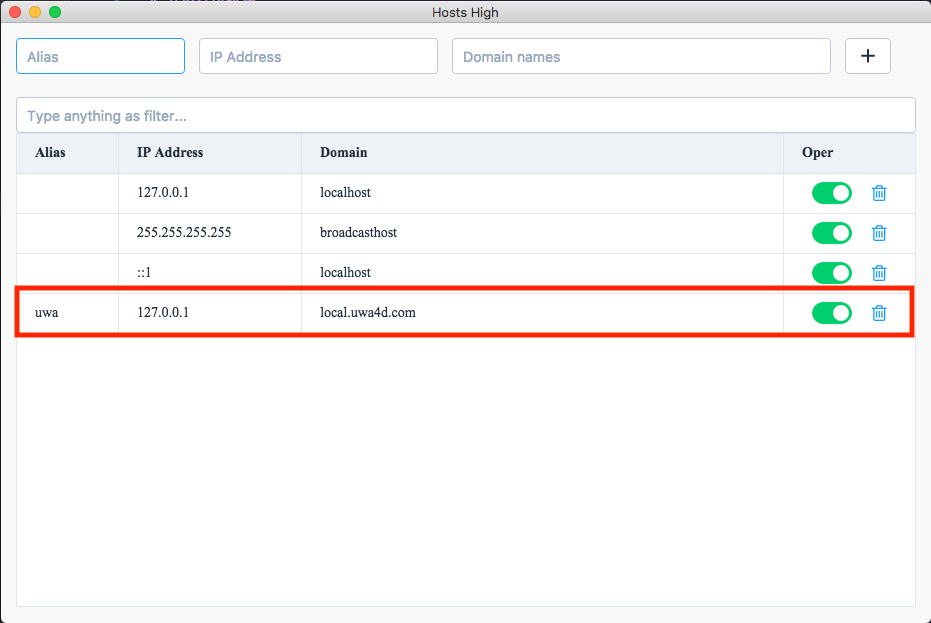

# 开发环境搭建

## 安装[node.js](https://nodejs.org/en/)

> 没有特别配置细节，一路下一步即可

## 安装[git](https://git-scm.com/downloads)

> 没有特别配置细节，一路下一步即可

## 下载[vscode](https://code.visualstudio.com/)

### 安装以下[vscode](https://code.visualstudio.com/)扩展

1. [eslint](https://marketplace.visualstudio.com/items?itemName=dbaeumer.vscode-eslint)
2. [favorites](https://marketplace.visualstudio.com/items?itemName=howardzuo.vscode-favorites)
3. [language-stylus](https://marketplace.visualstudio.com/items?itemName=sysoev.language-stylus)
4. [stylus-supremacy](https://marketplace.visualstudio.com/items?itemName=thisismanta.stylus-supremacy)
5. [npm-dependency](https://marketplace.visualstudio.com/items?itemName=howardzuo.vscode-npm-dependency)
6. [prettier](https://marketplace.visualstudio.com/items?itemName=esbenp.prettier-vscode)
7. [rainbow-brackets](https://marketplace.visualstudio.com/items?itemName=2gua.rainbow-brackets)
8. [vetur](https://marketplace.visualstudio.com/items?itemName=octref.vetur)

> 依赖安装完毕后，重启[vscode](https://code.visualstudio.com/)，打开本项目时，`.vscode/settings.json`会被 IDE 自动读取并激活

## 安装[hosts-high](https://github.com/leftstick/hosts-high/blob/master/README.md)

> 下载解压即可，用来控制本地`host`文件的。接下来打开她，按照下图配置需要的`host`

