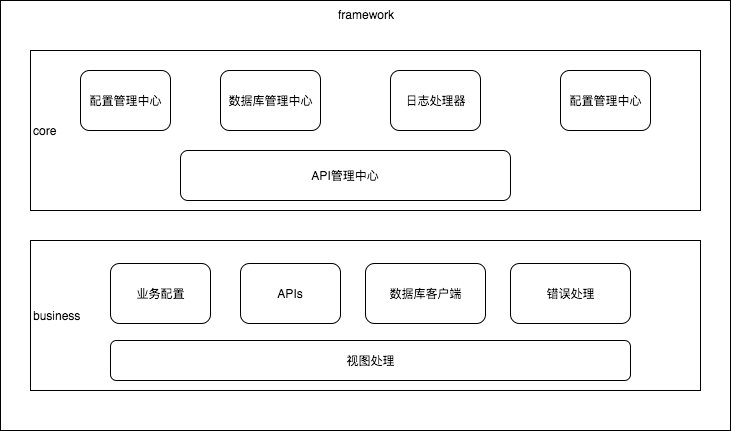
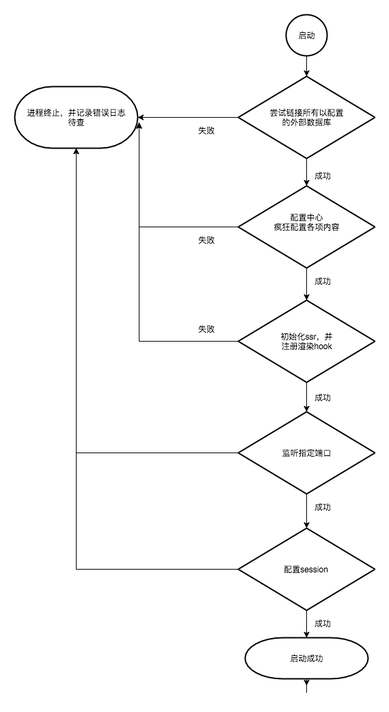

# 系统概述

来到这里，让我们先看两张图了解下整个系统的大致状况

## 系统架构图

> 图虽简陋，能了解概况即可，不必较真。其中`视图处理`部分，我们抛弃了传统的`模板引擎 + 数据`的组合方式，而改用了前后端同构的、基于[vue](https://vuejs.org/)(一个客户端渐进式框架)的服务器端渲染(ssr)技术栈。关于`vue-ssr`，可以参考[ssr.vuejs](https://ssr.vuejs.org)

## 视图处理

> 视图处理部分直接用了官方图片，色彩丰富了许多啊！

这里要简述的只有一个问题，就是`同构`。`同构`在这里是指同一份源码(`web_app`目录下的内容)，经过编译，分别生成了一份可用于服务器端渲染(用户的页面请求直接命中服务器后，服务器端响应完整的`html`结果)的代码(`server bundle`)；以及一份可用于客户端渲染(用户在客户端通过点击页面链接，同一应用内跳转时，`vue`拦截页面跳转请求发向服务器，在客户端直接通过已经加载好的模板和从服务器端拿来的数据进行渲染)的代码(`client bundle`)。

## 服务器启动过程

